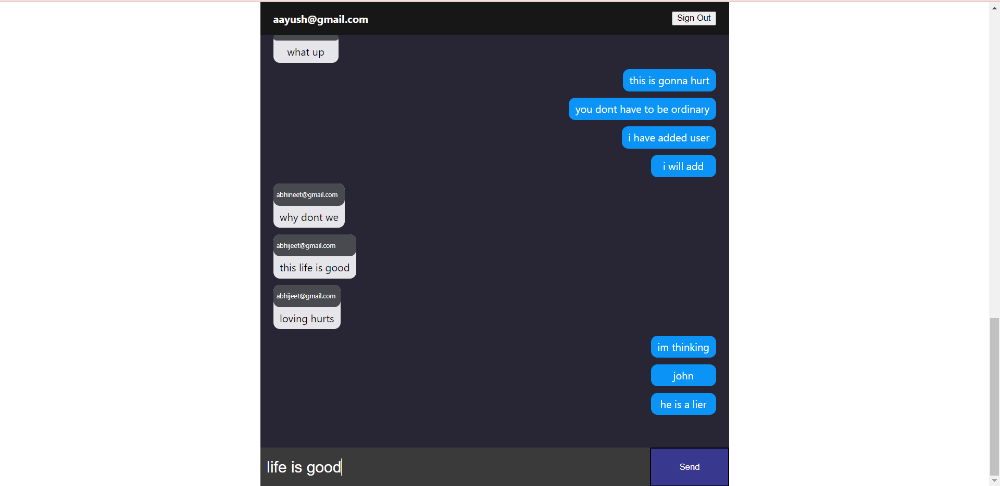

# Inforida Teacher Student Chat App
## Local Setup Instructions
- Open your terminal and then type: $ git clone git@github.com:AayushKShrivastava/inforida_chat_app.git This clones the repo.
- Open the cloned repository in vscode.
- cd into the chat_frontend folder: $ cd chat_frontend 
- To installs the required dependencies: $ npm install 
- To run the React project: $ npm start

## Working
### Login
#### Demo User Credentials:
| Email              | Password |
| ------------------ | -------- |
| aayush@gmail.com   | aayush   |
| abhijeet@gmail.com | abhijeet |
| abhineet@gmail.com | abhineet |

## Chatroom

### Header
The header displays the current user's email, and also the button to sign out of the chatroom

### Messages
This section displays the chat between users. The blue colored messages are sent by the current users and the white ones are sent by other users.

## Technology used
- React, Firebase Authentication, Firestore

I have also written the firestore rules to ensure only authorized users have access to the data 

